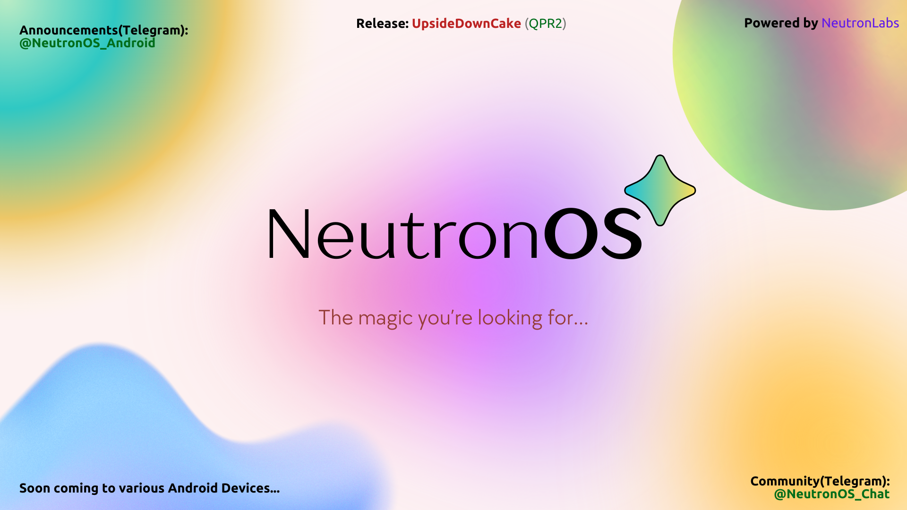

# NeutronOS 🚀


NeutronOS is a custom ROM based on the Google's Android-Open-Source-Project that prioritizes security 🔒, stability ⚖️, performance 🏎️, and seamless updates 🔄. Our goal is to provide users with a minimal design and maximum control, delivering an exceptional user experience.

## Features 🌟

- **Security**: NeutronOS is built with a strong focus on security, ensuring that your device and data are protected 🔒.
- **Integrity**: NeutronOS stable builds will be always signed and Encrypted.   
- **Stability**: We strive to provide a stable and reliable ROM, eliminating crashes and system errors ⚖️.
- **Performance**: NeutronOS is optimized for speed and efficiency, delivering smooth performance even on resource-constrained devices 🏎️.
- **Seamless Updates**: With our seamless update mechanism, you can enjoy the latest features and security patches without any hassle 🔄.
- **Seamless Haptics**: Our haptic implementation offers a seamless and immersive user experience similar to Stock, enhancing the overall usability and interaction with the device.
- **Minimal Design**: We believe in simplicity and elegance. NeutronOS offers a clean and minimalistic user interface, with some basic customizations, enhancing usability and reducing distractions 🎨. 
- **Other features**: Much more in the making...👨🏻‍🔬

## Currently supported devices:
- lunaa (realme GT Master edition)
- ...?

## Flashing Instructions ⚡️

To get started with NeutronOS, follow these steps:

1. Ensure that your device is compatible with NeutronOS. Check our website for a list of supported devices 📱.
2. Unlock your device's bootloader(depends on the device's flashing methods) and install a custom recovery (e.g., TWRP, OrangeFox, or Official NeutronOS recovery) 🔓.
3. Download the latest NeutronOS package 📥.
4. Boot into recovery mode, then goto sideload mode and start the flashing process of NeutronOS 📲.
- Command:
```
adb sideload <filename.zip>
```
5. Wipe your device's data (Format the device) 🧹.
6. Reboot your device and enjoy NeutronOS! 🎉

## Support and Contributions ❤️

- If you encounter any issues, have any questions, or simply want to connect with the team, we're here to help! Join our community forums for discussions, insights, and to share your ideas 💡.

- We're committed to providing you with the best experience possible. Your feedback and suggestions are invaluable to us, and we encourage you to share them 📝.

- If you find value in what we do and would like to support us, consider making a donation. Your generosity helps us continue our work and keep NeutronOS available to our valued users 💖.


[](https://paypal.me/0xSecureByte)
[](https://www.buymeacoffee.com/chirantan.code)
[](https://github.com/sponsors/0xSecureByte)

> Every contribution, no matter how small, makes a big difference. **Thank you for your love and support ❤️**

